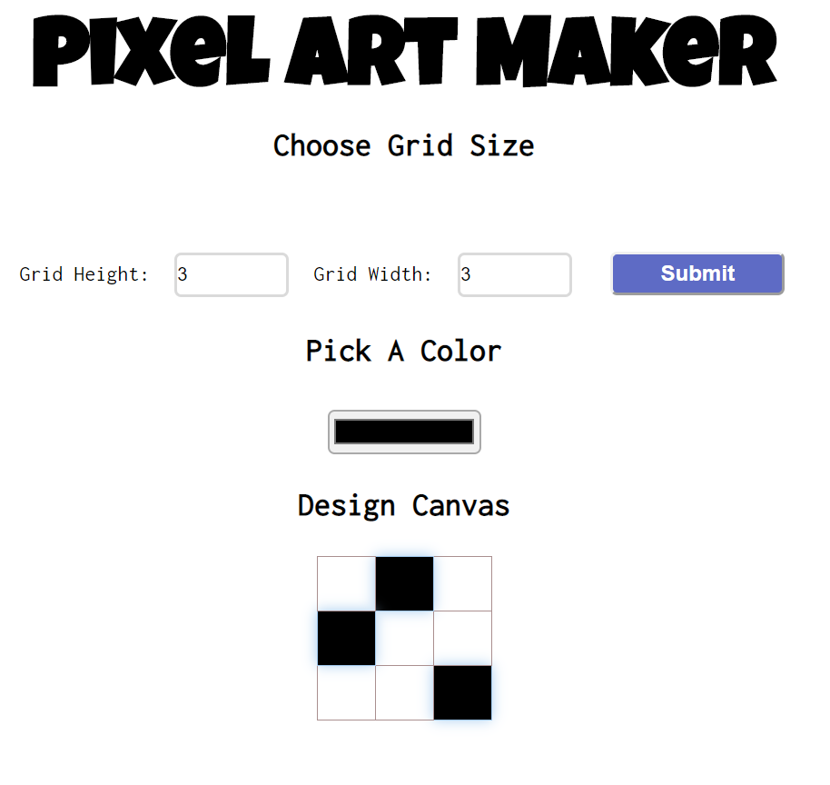

# Pixel Art Maker Project

## Table of Contents

* [Instructions](#instructions)
* [Contributing](#contributing)

## Instructions

To get started, open `designs.js` and start building out the app's functionality.

For specific, detailed instructions, look at the project instructions in the [Udacity Classroom](https://classroom.udacity.com/me).

## Contributing

This repository is the starter code for _all_ Udacity students. Therefore, we most likely will not accept pull requests.

## How to get started :-
Click on this [LINK](https://worm4047.github.io/pixel-art-maker/) to see the live version of the website.
### OR
Download or Clone the Project . After getting the file , Open the index.html in your browser to see the website up and running .
